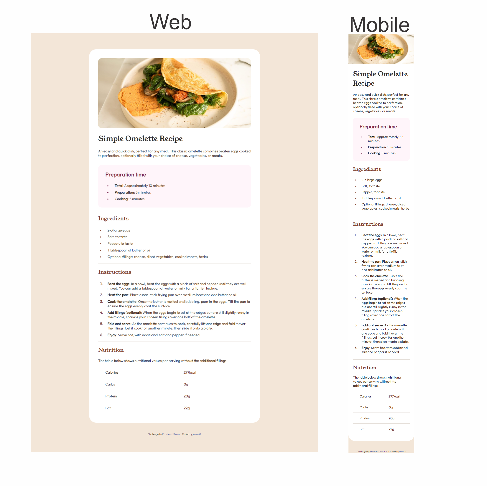

# Frontend Mentor - Recipe page solution

This is a solution to the [Recipe page challenge on Frontend Mentor](https://www.frontendmentor.io/challenges/recipe-page-KiTsR8QQKm). Frontend Mentor challenges help you improve your coding skills by building realistic projects. 

## Table of contents

- [Overview](#overview)
  - [Screenshot](#screenshot)
  - [Links](#links)
- [My process](#my-process)
  - [Built with](#built-with)
  - [What I learned](#what-i-learned)
  - [Continued development](#continued-development)
  - [AI Collaboration](#ai-collaboration)
- [Author](#author)

**Note: Delete this note and update the table of contents based on what sections you keep.**

## Overview

### Screenshot



### Links

- Solution URL: [Github](https://github.com/jazzzz0/recipe-page)
- Live Site URL: [Recipe Page - Github Pages](https://jazzzz0.github.io/recipe-page/)

## My process

### Built with

- Semantic HTML5 markup
- CSS3
- Responsive Design
- Media Queries
- **::marker** styles
- **@font-face** for local fonts

### What I learned

Used **clamp()** for the first time:

```css
.main-container {
    padding: clamp(0px, calc((100vw - 375px) * 0.2), 2.5em);
}

```

**::marker**:
```css
.instructions-container ol li::marker {
    font-weight: bold;
    color: hsl(14, 45%, 36%);
}
```

I also learnead about **border-collapse**:

```css
.nutrition-container table {
    border-collapse: collapse;
}
```

### Continued development

I wish to master CSS **clamp()**, and become more comfortable with CSS layout techniques such as Flexbox and Grid.

### AI Collaboration

- I worked with Github Copilot and ChatGPT.
- Both were used to ask questions about applying CSS rules to lists and tables, as well as keeping images contained within their containers.


## Author

- Frontend Mentor - [@jazzzz0](https://www.frontendmentor.io/profile/jazzzz0)
